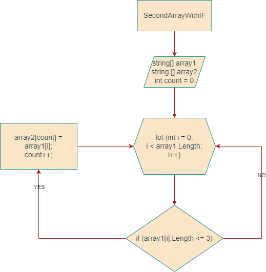

# Задача.

```
Написать программу, которая из имеющегося массива 
строк формирует новый массив из строк, длина которых меньше, 
либо равна 3 символам. Первоначальный массив можно ввести с 
клавиатуры, либо задать на старте выполнения алгоритма. 
При решении не рекомендуется пользоваться коллекциями, 
лучше обойтись исключительно массивами.

```
***
Примеры:
[“Hello”, “2”, “world”, “:-)”] → [“2”, “:-)”]
[“1234”, “1567”, “-2”, “computer science”] → [“-2”]
[“Russia”, “Denmark”, “Kazan”] → []
***

## Алгоритм решения
1. Создать репозиторий на GitHub
2. Нарисовать блок-схему алгоритма (можно обойтись блок-схемой основной содержательной части, если вы выделяете её в отдельный метод)
3. Снабдить репозиторий оформленным текстовым описанием решения (файл README.md)
4. Написать программу, решающую поставленную задачу
5. Вспомнить и использовать контроль версий в работе над этим небольшим проектом (не должно быть так, что всё залито одним коммитом, как минимум этапы 2, 3, и 4 должны быть расположены в разных коммитах)
6. Плясать от счастья, что нигде не пропустил точку с запятой и нет ошибок.

## Этапы действия задачи
1. Создаем два массива с построковым вводом (1 с содержанием, 2 такой же длины)
2. В цикле for делаем проверку условия <= 3
3. В случае, когда элемент первого массива подходит занести в count элемент второго массива.
4. После присвоения переменная count увеличивается на 1 и возвращается к циклу for в котором i увеличивается на 1.
5. Повторять до конца.

## Блок-схема алгоритма
